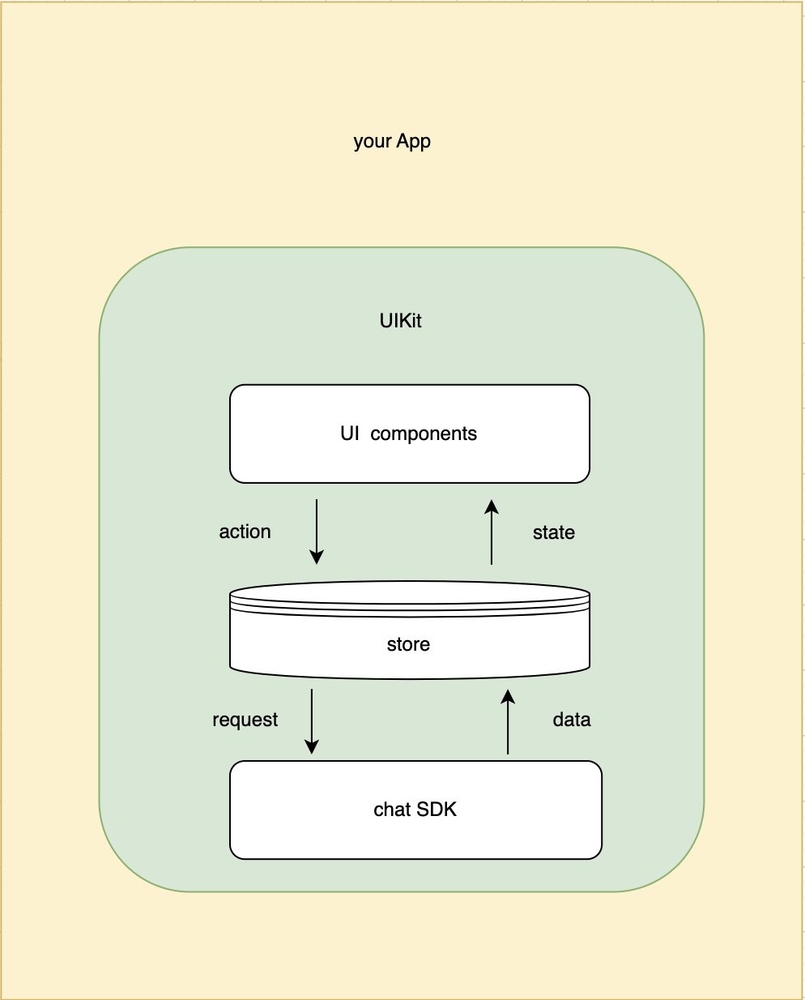

# Get Started with Agora Chat UIKit for Web

# What is Agora Chat UIKit for Web

`agora-chat-uikit` is a UI component library based on the Chat SDK. It provides common UI components, module components containing the chat business logic, and container components, allowing users to customize the UI using the renderX methods. `agora-chat-uikit` provides a UIKitProvider for data management. The UIKitProvider automatically listens for Chat SDK events to modify data for UI updates. Developers can use the library to quickly build custom instant messaging applications based on actual business requirements.

## Technical principles

Agora Chat UIKit consists of three parts: UI components, mobx store for data management, and chat SDK. UI components include container components, compound components module, and pure UI components. These components at different levels are accessible to the public. Users can reference any of these components to build their own applications. UIKit uses mobx to manage global data, and users can reference the rootStore to get all the data and the action methods for data manipulation. UIKit integrates the chat SDK and interacts with the server through the Chat SDK.

<div align=center> </div>

## Functions

The `agora-chat-uikit` repository provides the following functions:

- Implements automatic layout to match the width and height of the container.
- Sends and receives messages, displays messages, shows the unread message count, and clears messages. The text, image, file, emoji, and audio messages are supported.
- Searches for and deletes conversations.
- Customizes UI styles.

<table><tr><th valign="top">Module</th><th valign="top">Function</th><th valign="top">Description</th></tr>
<tr><td rowspan="2" valign="top">Conversation List</td><td valign="top">Conversation list</td><td valign="top">Presents the conversation information, including the user's avatar and nickname, content of the last message, unread message count, and the time when the last message is sent or received.</td></tr>
<tr><td valign="top">Delete conversation</td><td valign="top">Deletes the conversation from the conversation list.</td></tr>
<tr><td rowspan="2" valign="top">Chat</td><td valign="top">Message sender</td><td valign="top">Sends text, emoji, image, file, and voice messages.</td></tr>
<tr><td valign="top">Display message</td><td valign="top">Displays one-to-one messages or group messages, including the user's avatar and nickname and the message's content, sending time or reception time, sending status, and read status. The text, image, emoji, file, and voice, messages can be displayed.</td></tr> 
</table>

## Component

`agora-chat-uikit` provides the following components:

- Container components: [`UIKitProvider`](https://github.com/AgoraIO-Usecase/AgoraChat-UIKit-web/blob/main/docs/en/provider.md), [`Chat`](https://github.com/AgoraIO-Usecase/AgoraChat-UIKit-web/blob/main/docs/en/chat.md), and [`ConversationList`](https://github.com/AgoraIO-Usecase/AgoraChat-UIKit-web/blob/main/docs/en/conversation.md).
- Module components: `BaseMessage`, `AudioMessage`, `FileMessage`， `VideoMessage`, `ImageMessage`, `TextMessage`, `Header`, `Empty`, `MessageList`, `ConversationItem`, `MessageEditor`, `MessageStatus`.
- Pure UI components: `Avatar`, `Badge`, `Button`, `Checkbox`, `Icon`, `Modal`, `Tooltip`.

The full list of components by the UIKit can be view on the [Storybook page](Todo: you need to deploy storybook-static.zip and add the link here).

## store

UIKit provides the rootStore that contains all the data. rootStore consists of the following parts:

- initConfig: UIKit initialization data
- client: Chat SDK instance
- conversationStore: Conversation list data
- messageStore: Message data

For attributes and methods in the rootStore, see the [rootStore document](https://github.com/AgoraIO-Usecase/AgoraChat-UIKit-web/blob/main/docs/en/store.md).

## Prerequisites

In order to follow the procedure in this page, you must have:

- React 16.8.0 or later
- React DOM 16.8.0 or later
- A valid [Agora account](https://docs.agora.io/cn/AgoraPlatform/sign_in_and_sign_up).
- A valid [Agora project](https://docs.agora.io/cn/AgoraPlatform/sign_in_and_sign_up) with an App Key.

## Compatible browsers

| Browser | Supported Version |
| ------- | ----------------- |
| IE      | 11 or later       |
| Edge    | 43 or later       |
| Firefox | 10 or later       |
| Chrome  | 54 or later       |
| Safari  | 11 or later       |

## Project setup

### 1. Create a Web Chat UIKit project

```bash
# Install a CLI tool.
npm install create-react-app
# Create an my-app project.
npx create-react-app my-app
cd my-app
```

```
The project directory.

├── package.json
├── public # The static directory of Webpack.
│ ├── favicon.ico
│ ├── index.html # The default single-page app.
│ └── manifest.json
├── src
│ ├── App.css # The CSS of the app's root component.
│ ├── App.js # The app component code.
│ ├── App.test.js
│ ├── index.css # The style of the startup file.
│ ├── index.js # The startup file.
│ ├── logo.svg
│ └── serviceWorker.js
└── yarn.lock
```

### 2. Integrate the Web Chat UIKit

#### Install the Web Chat UIKit

- To install the Web Chat UIKit with npm, run the following command:

```bash
npm install agora-chat-uikit --save
```

- To Install Agora chat UIKit for Web with Yarn, run the following command:

```bash
yarn add agora-chat-uikit
```

#### Build the application using the agora-chat-uikit component

Import agora-chat-uikit into your code.

```javascript
// App.js
import React, { Component, useEffect } from "react";
import {
  UIKitProvider,
  Chat,
  ConversationList,
  useClient,
  rootStore,
} from "agora-chat-uikit";
import "agora-chat-uikit/style.css";

const ChatApp = () => {
  const client = useClient();
  useEffect(() => {
    client &&
      client
        .open({
          user: "",
          agoraToken: "",
        })
        .then((res) => {
          console.log("get token success", res);
          // create a conversation
          rootStore.conversationStore.addConversation({
            chatType: "", // 'singleChat' || 'groupChat'
            conversationId: "", // target user id or group id
            name: "", // target user nickname or group name
            lastMessage: {},
          });
        });
  }, [client]);

  return (
    <div>
      <div>
        <ConversationList />
      </div>
      <div>
        <Chat />
      </div>
    </div>
  );
};

class App extends Component {
  render() {
    return (
      <UIKitProvider
        initConfig={{
          appKey: "you app key",
        }}
      >
        <ChatApp />
      </UIKitProvider>
    );
  }
}

export default App;
```

#### Run the project and send your first message

```bash
npm run start
```

Now, you can see your app in the browser.

<div align=center style="background: #ddd; padding-top: 8px"> </div>

In the default App Key situation, for the convenience of quick experience, we support several types of message distribution by default. After clicking to select a member, enter your first message and send it.

**Note**

If a custom App Key is used, no contact is available by default and you need to first [add contacts](https://docs.agora.io/en/agora-chat/client-api/contacts) or [join a group](https://docs.agora.io/en/agora-chat/client-api/chat-group/manage-chat-groups).

Agora provides an open source AgoraChat UIKit web project on GitHub, where you can clone and run the project or reference the logic to create a project that integrates agora-chat-uikit.

- [URL for Agora Chat UIKit Web source code ](https://github.com/easemob/Easemob-UIKit-web)
- [URL for Agora chat application using agora-chat-uikit](https://github.com/AgoraIO-Usecase/AgoraChat-web/tree/dev-2.0)

## How to customize the UIKit

### Modify the component style

In this section, the `Chat` and `Button` components are used as an example to describe how to modify the component style.

You can modify the style of the `Chat` and `Button` components by passing in `className`, `style`, and `prefix` through the component props.

```jsx
import { Chat, Button } from "agora-chat-uikit";

const ChatApp = () => {
  return (
    <div>
      <Chat className="customClass" prefix="custom" />
      <Button style={{ width: "100px" }}>Button</Button>
    </div>
  );
};
```

### Use custom components

This section uses the `CustomHeader` component to describe how to use custom components.

You can render the `CustomHeader` component by using the `renderHeader` method of the container component `Chat`.

```jsx
import {Chat, Header} from 'agora-chat-uikit'

const ChatApp = () => {
  const CustomHeader = <Header back content="Custom Header">
  return(
    <div>
      <Chat renderHeader={(cvs) => CustomHeader}>
    </div>
  )
}
```

### Modify the theme

The UIKit style is developed using the SCSS framework and defines a series of global style variables, including but not limited to global styles (the primary color, background color, rounded corners, borders, and font size).

For how to modify the theme, see the [Github URL](https://github.com/AgoraIO-Usecase/AgoraChat-UIKit-web/blob/main/docs/en/theme.md).

If the above three UIKit customization methods cannot meet your requirements, you can also locate the elements to overwrite the style of UIKit.

## Community Contribution

If you want to add extra functions to agora-chat-uikit to share with others, you can fork our repository on GitHub and create a pull request. For any questions, please also submit it on the repository. Thank you for your contribution!

## Feedback

If you have any problems or suggestions regarding the sample projects, feel free to file an issue.

## Reference

- [Agora Chat SDK Product Overview](https://docs.agora.io/en/agora-chat/overview/product-overview)
- [Agora Chat SDK API Reference](https://api-ref.agora.io/en/chat-sdk/web/1.x/index.html)

## Related resources

- Check our [FAQ](https://docs.agora.io/en/faq) to see if your issue has been recorded.
- Dive into [Agora SDK Samples](https://github.com/AgoraIO) to see more tutorials
- Take a look at [Agora Use Case](https://github.com/AgoraIO-usecase) for more complicated real use case
- Repositories managed by developer communities can be found at [Agora Community](https://github.com/AgoraIO-Community)
- If you encounter problems during integration, feel free to ask questions in [Stack Overflow](https://stackoverflow.com/questions/tagged/agora.io)

## License

The sample projects are under the MIT license.
